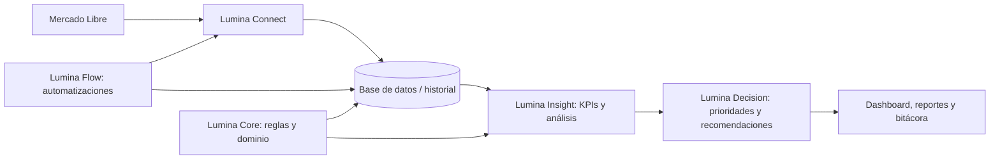

# DOC-103 — Arquitectura conceptual

**Estado:** Base de diseño  
**Última actualización:** 2026-07-26

## Principios

- El dominio de Lumina es independiente de Mercado Libre.
- Los datos originales son inmutables.
- Toda información relevante mantiene historial.
- Las integraciones no escriben sobre fuentes originales.
- Los módulos deben poder evolucionar sin romper el resto del sistema.

## Capas del sistema

## Módulos

| Módulo | Responsabilidad | Estado |
|---|---|---|
| Lumina Core | Dominio, reglas y estados de activos. | Documentado |
| Lumina Connect | Conexión con Mercado Libre y normalización. | Pendiente |
| Data Warehouse | Historial estructurado de negocio y canal. | Pendiente |
| Lumina Insight | KPIs, análisis y detección de alertas. | Pendiente |
| Lumina Decision | Priorización de oportunidades y recomendaciones. | Pendiente |
| Lumina Flow | Automatizaciones con n8n. | Pendiente |
| Reportes y Dashboard | Presentación y seguimiento de resultados. | Pendiente |

## Límites de v0.1.0

Esta versión no contiene código ejecutable ni credenciales. Es una fundación documentada para que las decisiones posteriores sean trazables.
