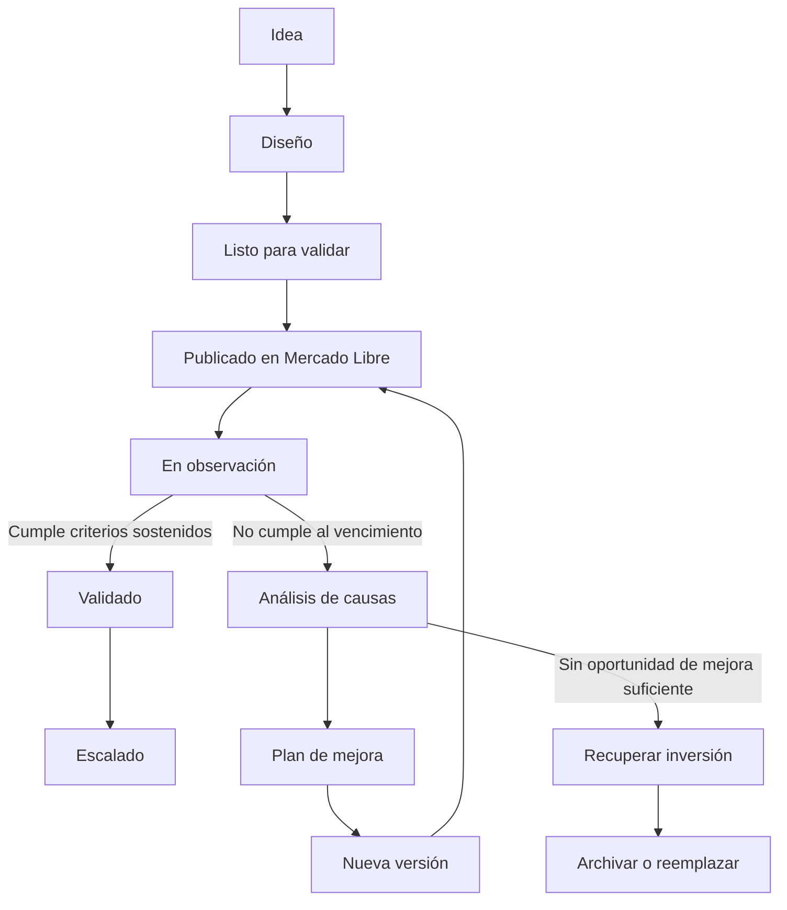

# DOC-102 — Reglas de negocio y ciclo de vida

**Estado:** Aprobado para v0.1.0  
**Última actualización:** 2026-07-26

## Ciclo de vida del activo

## Reglas fundacionales

1. Todo activo nace para validar una hipótesis.
2. Todo activo tiene una versión; la inicial es V1.
3. Todo experimento posee fecha de inicio, fecha límite y criterios de evaluación.
4. La validación se determina con métricas objetivas, no con intuiciones aisladas.
5. Todo experimento debe registrar al menos un aprendizaje.
6. Los activos no se eliminan: se archivan para preservar el historial y el conocimiento.
7. Las publicaciones pertenecen a Mercado Libre; los activos pertenecen a Lumina.
8. Al no validarse un activo dentro de su plazo, se investigan causas, se aplican mejoras pertinentes y se prueba una nueva versión cuando corresponda.
9. Si una nueva versión sigue sin validarse, se busca recuperar la inversión y se decide entre una mejora posterior, archivo o reemplazo por otro activo.
10. La IA puede priorizar y recomendar; la aprobación de acciones comerciales sigue siendo humana.

## Pregunta que guía el sistema

> ¿Dónde conviene invertir el próximo peso de Lumina?

## Decisiones pendientes

- Definir duración estándar de los experimentos.
- Definir umbrales de ventas, margen, conversión y calificaciones por categoría.
- Definir cómo se calcula el costo de desarrollo y recuperación de inversión.
