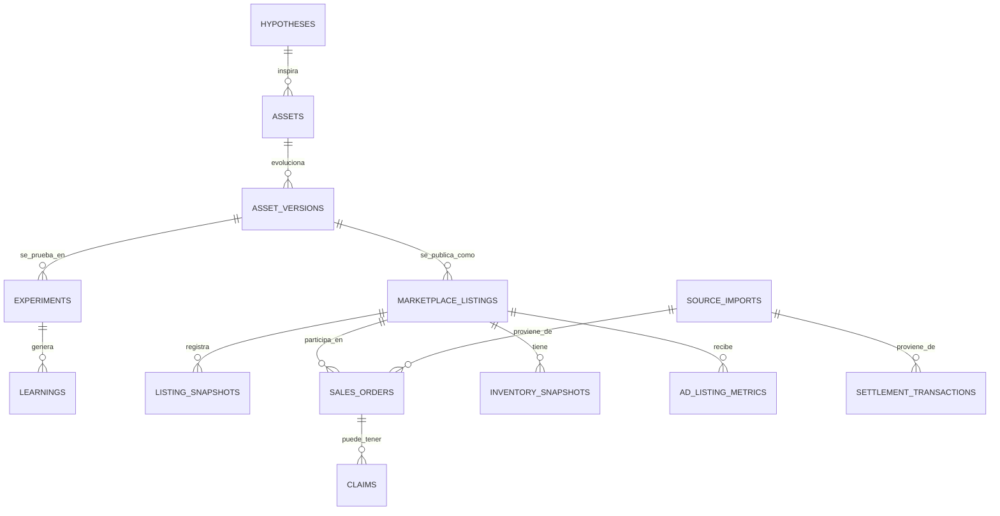

# DOC-203 — Modelo físico inicial

**Motor objetivo:** Supabase / PostgreSQL.  
**Estado:** listo para revisión antes de ejecutar.

## Modelo

## Decisiones

- `assets` y `asset_versions` representan la realidad de Lumina; no se crean desde una publicación automáticamente.
- `marketplace_listings` representa Mercado Libre y puede estar vinculado a una versión del activo cuando Lumina valide el SKU o la relación manualmente.
- Se conservan snapshots para publicaciones, stock, publicidad y métricas agregadas.
- `source_imports` permite rastrear cada dato al archivo original sin guardar datos personales en las tablas analíticas.
- Los valores monetarios se guardan como `numeric`, nunca como texto formateado.

## No ejecutar todavía si

- No se creó el proyecto Supabase.
- No se validó qué fila contiene el encabezado real de cada exportación en el proceso de importación.
- No se definió quién puede operar credenciales y cargas productivas.
